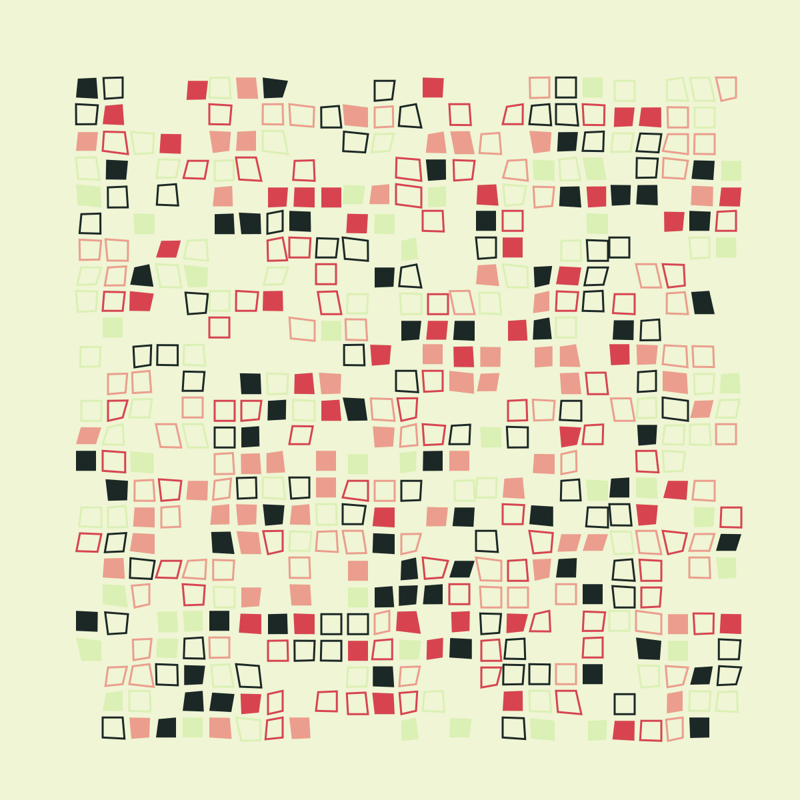

# Generative Art: Benjamin Kovach's code

This document explains how to generate some
artwork using the code discussed in [this post by Benjamin Kovach](https://www.kovach.me/posts/2018-03-07-generating-art.html)

## Setup

We need to install a C library for generating
images, make a directory in which the images
will be stored, and then run `stack build`.
The latter will take a while.  Once that is
done, we can generate some images using Kovach's code.

### Clone the repository

```
$ git clone git@github.com:jxxcarlson/genart-kovach.git && cd genart-kovach
```

### Install the C library `cairo`:

```
$ brew install cairo
...
Bash completion has been installed to:
  /usr/local/etc/bash_completion.d
```

### Make the image directory

```
$ mkdir -p images/example_sketch
```

### Build the code  

```
$ stack build
```

## Make an image

```
$ stack run
```

You will find the generated image in `images/example_sketch`, e.g,


